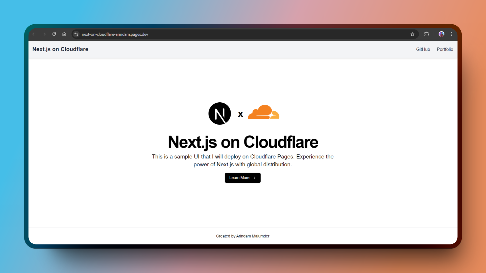

# Next.js on Cloudflare - Demo



This project is a simple demonstration of how to deploy a Next.js application to Cloudflare Pages. It covers the basic setup, deployment steps, and configuration for a seamless integration with Cloudflare's powerful CDN and edge network.

## 🚀 Features

- **Next.js 14** with App Router and API routes support.
- **Server-side rendering (SSR)** and **Static Generation**.
- Optimized for **Cloudflare Pages**.
- Built-in support for **Edge functions**.

## 🛠 Prerequisites

- **Node.js** installed (v18.x.x or later).
- A **Cloudflare account** with access to Cloudflare Pages.
- A **GitHub** repository (or GitLab) to connect with Cloudflare Pages.

## ⚙️ Installation and Setup

1. **Clone the repository**:
    ```bash
    git clone https://github.com/Arindam200/next-on-cloudflare.git
    cd next-on-cloudflare
    ```

2. **Install dependencies**:
    ```bash
    npm install
    ```

3. **Run the Next.js app locally**:
    ```bash
    npm run dev
    ```

4. **Build the app** for production:
    ```bash
    npm run build
    ```

## 📄 License

This project is open-source and available under the [MIT License](LICENSE).
